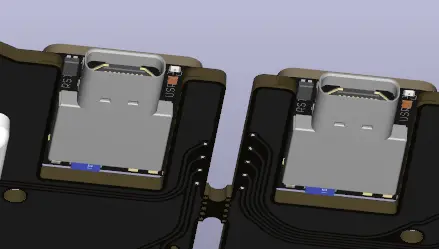

## Tricks

In my goals for this project, my number one goal was really the battery life. However, on a tiny split keyboard, I have not seen any good battery mounting methods that do not involve tenting the keyboard to make space below it or having it on the side. I want the battery to be part of the keyboard such that the keyboard's physical footprint doesn't have to extend too much to accommodate for it.

In conventional wireless split keyboards, the battery is placed under the microcontroller, which is usually above the thumb keys. This approach means that the battery is basically completely hidden, which is aesthetically pleasing, but the problem is that the biggest battery that can really fit under the microcontroller only has a capacity of 150mAh. Using the [ZMK Power Profiler](https://zmk.dev/power-profiler), we can estimate that the battery life of the central half will only be around 2 weeks (given a nice!nano v2 and the default parameters for everything else), which is far too short in my opinion.

Putting the battery under the keyboard is out of the question, since:
1. There are many sharp points under the PCB, risking battery damage.
2. I will have to tent the keyboard, which I don't want to do.

So, my solution was to scrap using conventional pro-micro-sized boards and use the XIAO nRF52840. This allows me to do several things:
- The board features holes which also have castellated holes on the side, meaning that I am able to mount this to a PCB like an SMD component rather than having to use pins.
- Saves money (compared to the nice!nano v2).

However, mounting it like an SMD component comes with more challenges. The main one being that the XIAO microcontroller has SMD pads on the back for, among other things, the battery inputs. This makes things difficult since I can't simply solder the microcontroller to the PCB like a normal SMD component unless I want to cut off my access to the battery pads. My solution? Mount the microcontroller right-side-up, but UNDER the keyboard PCB, then cut away the part of the PCB between the pads. This is possible since the pads/holes on the microcontroller are on both sides of the microcontroller.

Top view:

Bottom view:

## KiCAD

KiCAD was my software of choice for designing the keyboard. After using it for a while, I feel like it is a rather robust PCB design software, and I had little to no difficulty getting a feel for it.

Due to my trick that I mentioned above, I have to also customize the XIAO footprint in the software such that the pads are designed to be used with an upside-down microcontroller.

It also turns out that I knew basically nothing about PCBs, and it took a long time for me to come across the term "via". In case you don't know, a via is essentially a plated hole which allows traces from one side of the board to connect to traces on the other side of the board. This is super useful for wiring, since I can essentially weave my way around traces without having to worry about leaving space for other traces.